# Online Payments In Albania Course Plan

## Goal

Build a practical, gateway-agnostic course series that helps developers understand how to integrate online card payments in Albania.

The course uses PokPay as the working implementation because, based on hands-on testing at the time of recording, it appears to provide the most self-service developer path currently available in Albania: business onboarding, API credentials, documentation, staging access, and CDN-based payment flows with minimal human intervention.

The course should be clear that it is not sponsored by, affiliated with, or paid by PokPay. PokPay should receive credit where appropriate for solving a real developer-experience gap in the Albanian market, but students should still evaluate pricing, contracts, settlement timelines, support, reliability, compliance, and business fit before choosing any payment provider.

The repository is a working demo and validation harness, not a production payment platform or reusable SaaS starter kit. It focuses on the core payment flows a developer needs to understand first:

1. Guest checkout with the PokPay CDN form.
2. Saving a card safely through tokenization.
3. Paying with a saved card and 3-D Secure.
4. Authorizing now and capturing later.

Production hardening is intentionally kept as a final module/checklist. The course should still clearly explain what must be added before real production usage.

Recurring teaching pattern:

```text
For the demo, we do X so the payment flow is visible.
For production, you must do Y before trusting the payment state.
```

---

## Audience

Primary audience: intermediate developers building or serving Albanian businesses who can already read JavaScript/TypeScript, understand HTTP requests, and run a local backend.

Secondary audience: technical founders and product people who need to understand what their team must build and which payment-provider questions matter.

The course is for developers building Albanian commerce, SaaS, booking, marketplace, invoice-payment, or subscription-style applications who need a practical path from zero to a working payment gateway integration.

The course should prioritize practical implementation over payment theory, while still explaining enough fundamentals to prevent dangerous misunderstandings.

This is not a beginner web development course. Students do not need previous payment-gateway experience, but they should be comfortable following backend/frontend code.

---

## Course Positioning

This is a gateway-agnostic payments course with a PokPay implementation.

Universal concepts taught throughout the course:

- Payment gateway vs bank vs merchant account.
- Frontend/backend/gateway trust boundaries.
- Authorization and capture.
- Auto-capture vs manual capture.
- Tokenization.
- 3-D Secure.
- Webhooks and server-side verification.
- Refunds, disputes, settlement, and reconciliation at a practical level.
- Idempotency and duplicate-operation risk.
- Demo vs production responsibilities.

PokPay-specific implementation details:

- API authentication and base URLs.
- SDK order creation.
- CDN payment form usage.
- Card tokenization endpoint.
- Saved-card 3DS setup.
- Capture endpoint.
- Order-details lookup endpoint.
- Webhook endpoint shape, if production/staging configuration supports it.

Recommended disclaimer:

```text
I am not affiliated with, sponsored by, or paid by PokPay. I am using PokPay in this course because it currently provides the most developer-friendly path I have found for integrating online card payments in Albania: accessible onboarding, API documentation, staging credentials, and a practical checkout SDK/CDN flow.
```

Market-context message:

```text
In Albania, integrating online payments is not always as simple as installing Stripe. Stripe is not directly available locally, and traditional bank integrations may involve slower, relationship-driven onboarding. Based on my hands-on testing at the time of recording, PokPay currently appears to be the most self-service developer option I have found. This may change, and every business should still evaluate banks and other providers for pricing, settlement, support, contracts, and fit.
```

---

## Course Format

The course should be a YouTube playlist, not one long video. Each video should solve one concrete payment problem and be useful on its own, while still building toward the full integration.

Use a story-driven structure: Acme, a generic Albanian business, grows its payment capabilities step by step.

Recommended lesson rhythm:

1. Start with a realistic business scenario.
2. Explain the payment concept needed to solve it.
3. Show the local demo flow in the browser.
4. Walk through the frontend/backend boundary.
5. Walk through the gateway call.
6. Show what is stored in the database.
7. End with a short Demo vs Production caveat.

Recommended playlist:

1. Online Payments in Albania: What Developers Need to Know.
2. Payment Gateway Architecture: Frontend, Backend, Gateway, Bank.
3. Setting Up a Local Payment Integration Project.
4. Guest Checkout with a Hosted/CDN Payment Form.
5. Saving Cards Safely with Tokenization.
6. Charging a Saved Card with 3D Secure.
7. Authorize Now, Capture Later.
8. Why Browser Payment Success Is Not Enough.
9. Refunds, Failures, Disputes, and Reconciliation.
10. Production Checklist for Payment Integrations.

The first video should be an introduction and bigger-picture explanation. Coding starts in the following videos.

Language policy:

- Titles in English.
- Narration in mixed Albanian-English.
- Technical terms, diagrams, code, comments, API names, and repository documentation in English.
- YouTube descriptions can be bilingual.

Example narration style:

```text
Ketu backend creates the order, sepse frontend nuk duhet te kete API secrets. Pastaj frontend mounts the PokPay CDN form.
```

---

## Current Repository Structure

```text
payment-integration-pok-pay-cdn/
├── plan.md
├── frontend/
│   ├── index.html          # Single-page demo UI
│   └── app.js              # Vanilla JS frontend logic
└── backend/
    ├── package.json
    ├── tsconfig.json
    ├── src/
    │   ├── index.ts        # Bun HTTP server and router
    │   ├── db.ts           # SQLite schema and dev migrations
    │   ├── logger.ts       # Structured logging helper
    │   ├── pokpay.ts       # PokPay API client
    │   └── routes/
    │       ├── createUser.ts
    │       ├── createOrder.ts
    │       ├── saveCard.ts
    │       ├── payWithSaved.ts
    │       ├── confirmOrder.ts
    │       ├── pokpayWebhook.ts
    │       └── captureOrder.ts
    └── data/
        └── pokpay.db       # Created locally at runtime
```

---

## Overall Application Flow

This diagram shows the main methods and network boundaries in the demo. The frontend calls only the local backend API and the PokPay CDN component. The backend is the only place that calls PokPay's authenticated API.

```mermaid
sequenceDiagram
    autonumber
    participant Student as Student/Browser
    participant FE as frontend/app.js
    participant CDN as PokPay CDN
    participant BE as Bun backend/index.ts
    participant DB as SQLite db.ts
    participant PP as PokPay API

    rect rgb(245, 248, 255)
        Note over Student,PP: Create Demo User
        Student->>FE: Click "Create User"
        FE->>BE: POST /api/users
        BE->>BE: handleCreateUser(body)
        BE->>DB: INSERT users
        BE-->>FE: { success, userId }
    end

    rect rgb(248, 255, 245)
        Note over Student,PP: Save Card Safely
        Student->>FE: Click "Save Card"
        FE->>CDN: PokPayment.renderAddCardForm(...)
        CDN-->>FE: onSuccess(cardPayload)
        FE->>BE: POST /api/cards
        BE->>BE: handleSaveCard(body)
        BE->>PP: authenticate()
        PP-->>BE: accessToken
        BE->>PP: tokenizeCard(accessToken, cardPayload)
        PP-->>BE: permanent card reference
        BE->>DB: INSERT cards
        BE-->>FE: { success, cardId }
    end

    rect rgb(255, 250, 240)
        Note over Student,PP: Guest Checkout
        Student->>FE: Click "Start Checkout"
        FE->>BE: POST /api/orders
        BE->>BE: handleCreateOrder(body)
        BE->>PP: authenticate()
        PP-->>BE: accessToken
        BE->>PP: createSdkOrder(accessToken, payload with webhookUrl)
        PP-->>BE: sdkOrder.id
        BE->>DB: INSERT orders status=PENDING
        BE-->>FE: { success, orderId }
        FE->>CDN: PokPayment.renderForm(container, orderId, ...)
        CDN-->>FE: onSuccess(result) or onError(error)
        FE->>BE: POST /api/orders/:orderId/confirm
        BE->>BE: handleConfirmOrder(orderId, body)
        BE->>PP: get order details, once implemented
        PP-->>BE: current gateway order state
        BE->>DB: UPDATE orders from verified gateway state
    end

    rect rgb(250, 245, 255)
        Note over Student,PP: Pay With Saved Card and 3DS
        Student->>FE: Click "Pay With Saved Card"
        FE->>BE: POST /api/orders
        BE->>PP: authenticate()
        BE->>PP: createSdkOrder(accessToken, payload with webhookUrl)
        BE->>DB: INSERT orders status=PENDING
        BE-->>FE: { success, orderId }
        FE->>BE: POST /api/prepare-token-payment
        BE->>BE: handlePrepareTokenPayment(body)
        BE->>PP: authenticate()
        BE->>PP: setup3DS(accessToken, cardId, orderId)
        PP-->>BE: payerAuthentication
        BE->>DB: UPDATE orders status=PENDING_3DS
        BE-->>FE: payerAuthentication
        FE->>CDN: PokPayment.setUpCardTokenPayment(...)
        CDN-->>FE: onSuccess(result) or onError(error)
        FE->>BE: POST /api/orders/:orderId/confirm
        BE->>PP: get order details, once implemented
        PP-->>BE: current gateway order state
        BE->>DB: UPDATE orders from verified gateway state
    end

    rect rgb(255, 245, 245)
        Note over Student,PP: Manual Capture
        Student->>FE: Click "Authorize Now"
        FE->>BE: POST /api/orders with autoCapture=false
        BE->>PP: authenticate()
        BE->>PP: createSdkOrder(accessToken, payload with autoCapture=false)
        BE->>DB: INSERT orders status=PENDING
        FE->>BE: POST /api/prepare-token-payment
        BE->>PP: setup3DS(accessToken, cardId, orderId)
        BE-->>FE: payerAuthentication
        FE->>CDN: PokPayment.setUpCardTokenPayment(...)
        CDN-->>FE: onSuccess(result)
        FE->>BE: POST /api/orders/:orderId/confirm targetStatus=AUTHORIZED
        BE->>PP: get order details, once implemented
        PP-->>BE: current gateway order state
        BE->>DB: UPDATE orders status=AUTHORIZED when verified
        Student->>FE: Click "Capture"
        FE->>BE: POST /api/orders/:orderId/capture
        BE->>BE: handleCaptureOrder(orderId, body)
        BE->>PP: authenticate()
        BE->>PP: captureSdkOrder(accessToken, orderId, body)
        PP-->>BE: capture result
        BE->>DB: UPDATE orders status=CAPTURED
        BE-->>FE: { success, status: "CAPTURED" }
    end

    rect rgb(240, 255, 255)
        Note over PP,DB: Authoritative Webhook Path
        PP-->>BE: POST /api/webhooks/pokpay
        BE->>BE: handlePokPayWebhook(payload)
        BE->>DB: UPDATE orders from gateway event
        BE-->>PP: { success: true }
    end
```



---

## Running Locally

The application runs with Bun. The backend serves both API endpoints and frontend static files.

1. Install Bun.
2. Create `backend/.env` locally with PokPay credentials.
3. Start the backend:

```bash
cd backend
bun run --watch src/index.ts
```

4. Open `http://localhost:4000`.

Required environment variables:

```env
POKPAY_KEY_ID=your_key_id
POKPAY_KEY_SECRET=your_key_secret
POKPAY_MERCHANT_ID=your_merchant_id
POKPAY_ENV=staging
PUBLIC_BASE_URL=https://your-public-tunnel-url
PORT=4000
```

Do not commit real credentials.

Local webhook testing:

- PokPay cannot call `localhost` directly, so local webhook testing requires a public HTTPS tunnel such as ngrok or Cloudflare Tunnel.
- `PUBLIC_BASE_URL` should point to that tunnel URL, for example `https://abc123.ngrok-free.app`.
- The backend uses `PUBLIC_BASE_URL` to send `webhookUrl` as `${PUBLIC_BASE_URL}/api/webhooks/pokpay` when creating SDK orders.
- Staging webhooks may require PokPay-side enablement, merchant/account whitelisting, static domains, or event-type configuration.
- Temporary tunnel domains may not be accepted by every gateway environment.
- In the current course setup, PokPay staging webhooks should not be treated as reliable or available.
- If no webhook arrives in staging, keep the browser-confirmation path for demo visibility and use server-side order lookup where available.

Before production, confirm with the provider:

- Whether webhooks are available.
- Which events are sent.
- How webhook authenticity is verified.

---

## Course Module 1: Payment Fundamentals

Purpose: give students enough vocabulary to understand what the code is doing.

Cover:

- Authorization: reserving funds on the card.
- Capture: moving an authorized payment toward settlement.
- Auto-capture vs manual capture.
- Tokenization: replacing card details with a reusable gateway token.
- 3-D Secure: issuer challenge/authentication flow.
- Refunds: returning funds after capture.
- Chargebacks/disputes: cardholder-initiated reversals.
- Settlement: money arriving in the merchant bank account.

Important teaching point:

Application status like `CAPTURED` is not the same as bank settlement. Developers must distinguish UI success, gateway state, and actual settlement/reconciliation.

Explanation style for each concept:

```text
Here is the concept.
Here is why developers get it wrong.
Here is how it appears in our code.
Here is what production must do.
```

Explain this as three separate layers:

- UI success: the browser callback or checkout component reports success, so the application can show a useful customer message. This improves UX, but it is not authoritative payment proof.
- Gateway state: PokPay reports that the order/payment is `AUTHORIZED` or `CAPTURED`. This should be confirmed server-side or through a trusted webhook/status mechanism before the backend treats the order as paid.
- Settlement/reconciliation: the merchant later confirms that the money appears in gateway settlement reports, acquirer reports, accounting records, or the merchant bank account.

Example timeline:

```text
Customer completes checkout
  -> frontend receives success callback
  -> backend verifies the transaction with PokPay or receives a trusted webhook
  -> application marks the order as paid/captured
  -> merchant fulfills the order according to business rules
  -> settlement report or bank reconciliation confirms the money movement later
```

In this demo, `CAPTURED` means the local application recorded a successful capture flow with PokPay. In a production system, `CAPTURED` should not be treated as the same thing as `SETTLED` or `RECONCILED`. Those are operational/accounting states that happen later and should be tracked separately if the business needs financial reconciliation.

---

## Course Module 2: PokPay Setup

Purpose: get students connected to the staging environment.

Cover:

- Merchant account and merchant ID.
- API credentials.
- Staging vs production.
- Environment variables.
- API base URLs:
  - staging: `https://api-staging.pokpay.io`
  - production: `https://api.pokpay.io`
- CDN script:

```html
<script src="https://static.pokpay.io/public/dist/pokpayments/pok-payment.js"></script>
```

Implementation files:

- `backend/src/pokpay.ts`
- `frontend/index.html`

---

## Course Module 3: Guest Checkout

Purpose: accept a one-time payment without saving a card.

Business story:

Acme needs to accept a one-time card payment from a customer who does not want to create an account. This could be an invoice payment, event ticket, service booking, product checkout, or course enrollment fee.

Flow:

1. Frontend asks backend to create a PokPay SDK order.
2. Backend authenticates with PokPay.
3. Backend creates the SDK order.
4. Frontend mounts the CDN payment form with `PokPayment.renderForm`.
5. PokPay CDN handles card entry and payment UI.
6. Frontend receives success/error callback.
7. Backend verifies the order through PokPay order-details lookup where possible.
8. Demo backend records the result for visibility.

Relevant API:

| Method | Path | Purpose |
| --- | --- | --- |
| POST | `/api/orders` | Create SDK order |
| POST | `/api/orders/:orderId/confirm` | Confirm browser result and verify order where possible |

Relevant files:

- `frontend/app.js`
- `backend/src/routes/createOrder.ts`
- `backend/src/routes/confirmOrder.ts`

Teaching caveat:

The browser success callback is useful for UX, but it is not authoritative proof that payment is finally settled. In the demo, browser confirmation keeps the flow visible, and the backend asks PokPay for the order details before updating local status where possible.

Amount and currency note:

```text
Before creating an order, remember that a payment amount is not just a number. Confirm the currency, whether the gateway expects decimal major units or integer minor units, and where the amount comes from. In the demo, amounts can be simple for testing. In production, the backend should calculate the amount from trusted business data such as an invoice, product, booking, or cart.
```

Demo vs Production:

```text
Demo: the browser callback helps us see the flow working.
Better demo/production fallback: backend checks the order with PokPay.
Production: use signed webhooks or trusted server-side verification before treating an order as paid.
```

---

## Course Module 4: Saving Cards Safely

Purpose: let a user save a card without the application handling raw card data directly.

Business story:

Acme has returning customers who pay invoices, book services, or buy repeatedly. The business wants faster future payments, but the application should not touch or store raw card numbers.

Main teaching point:

```text
In this demo, a saved card is not a card number. It is a PokPay card reference connected to our local user, plus a few safe display fields like last four digits and cardholder name.
```

Flow:

1. Student creates a demo user.
2. Frontend mounts `PokPayment.renderAddCardForm`.
3. PokPay CDN collects card details.
4. CDN returns a tokenization payload.
5. Backend sends that payload to PokPay `tokenize-guest-card`.
6. PokPay returns a permanent card token/reference.
7. Backend stores only the safe card reference and display metadata.

Relevant API:

| Method | Path | Purpose |
| --- | --- | --- |
| POST | `/api/users` | Create demo user |
| POST | `/api/cards` | Tokenize and save card reference |
| GET | `/api/cards/:userId` | Fetch saved cards for a user |

Database fields:

- `pokpay_card_id`
- `user_id`
- `last4`
- `holder_first_name`
- `holder_last_name`
- `created_at`

Do not store:

- PAN/card number.
- CVV/security code.
- Raw sensitive tokenization payloads in logs.
- API secrets.

Consent note:

```text
Before saving a card, the UI should make it clear that the customer is choosing to save this payment method for future use.
```

Demo vs Production:

```text
Demo: the user is a local test user.
Production: saved cards must belong to an authenticated customer, and the backend must verify ownership before using a card for payment.
```

Relevant files:

- `frontend/app.js`
- `backend/src/routes/createUser.ts`
- `backend/src/routes/saveCard.ts`
- `backend/src/db.ts`
- `backend/src/pokpay.ts`

---

## Course Module 5: Paying With A Saved Card And 3DS

Purpose: charge a previously saved card while handling 3-D Secure.

Business story:

Acme wants returning customers to pay again with a saved card. The checkout is faster, but the bank may still require 3-D Secure authentication before the payment can continue.

Main teaching point:

```text
A saved card makes checkout faster, but it does not remove the need for authentication, authorization, or backend verification.
```

Flow:

1. Frontend creates an SDK order.
2. Frontend sends `cardId`, `orderId`, and `userId` to backend.
3. Backend calls PokPay setup-tokenized-3DS.
4. Backend returns `payerAuthentication` to frontend.
5. Frontend calls `PokPayment.setUpCardTokenPayment`.
6. PokPay CDN handles the 3DS challenge flow.
7. Frontend receives success/error callback.

Relevant API:

| Method | Path | Purpose |
| --- | --- | --- |
| POST | `/api/orders` | Create SDK order |
| POST | `/api/prepare-token-payment` | Prepare 3DS for saved-card payment |
| POST | `/api/orders/:orderId/confirm` | Confirm browser result and verify order where possible |

Relevant files:

- `frontend/app.js`
- `backend/src/routes/payWithSaved.ts`
- `backend/src/pokpay.ts`

Teaching caveat:

This is the most important place to explain that 3DS completion, frontend callback, gateway authorization, capture, and settlement are related but distinct states.

Subscription caveat:

```text
Saved cards are often a building block for subscriptions, but this demo does not implement automatic recurring billing. It only shows a customer-initiated saved-card payment with 3DS.
```

---

## Course Module 6: Manual Capture

Purpose: show the difference between immediate capture and delayed capture.

Business story:

Acme accepts the customer payment intent today, but only captures after another business event happens: courier delivery, inventory confirmation, booking approval, service completion, or marketplace seller acceptance.

Main teaching point:

```text
Authorization reserves funds. Capture moves the authorized payment toward settlement. Authorization is not forever; holds can expire depending on the provider, bank, and card network rules.
```

Flow:

1. Create SDK order with `autoCapture: false`.
2. Use saved-card 3DS flow to authorize the payment.
3. Store the order as `AUTHORIZED` in the demo database.
4. Call backend capture endpoint later.
5. Backend calls PokPay capture endpoint.
6. Demo database marks the order as `CAPTURED`.

Relevant API:

| Method | Path | Purpose |
| --- | --- | --- |
| POST | `/api/orders` | Create SDK order with `autoCapture: false` |
| POST | `/api/prepare-token-payment` | Prepare 3DS authorization |
| POST | `/api/orders/:orderId/confirm` | Confirm authorization result and verify order where possible |
| POST | `/api/orders/:orderId/capture` | Capture authorized order |

Relevant files:

- `frontend/app.js`
- `backend/src/routes/captureOrder.ts`
- `backend/src/pokpay.ts`

Discuss:

- Full capture.
- Capture amount validation.
- Duplicate capture attempts.
- Partial capture, multiple capture, or split payments only as brief advanced mentions if provider support is confirmed.

---

## Course Module 7: Authoritative Verification

Purpose: explain what a real integration must do after the browser callback.

Recommended title:

```text
Why Browser Payment Success Is Not Enough
```

Current demo behavior:

- `confirmOrder.ts` receives the frontend callback and performs backend order lookup where possible.
- If the lookup cannot verify or map the gateway state, the local order status remains unchanged and the UI shows pending verification.
- The browser callback still makes the flow visible while testing the CDN behavior.
- `pokpayWebhook.ts` exists to receive authoritative gateway events when PokPay webhook delivery is enabled and reachable.

Verification behavior:

- `backend/src/pokpay.ts` includes a lightweight PokPay order-details lookup.
- `confirmOrder.ts` uses it so the backend can ask PokPay for the current order state after browser success.
- Browser callback data is context, not final truth.
- The webhook endpoint remains the preferred production architecture when supported.

Local/staging caveat:

- The demo can send `webhookUrl` when creating the SDK order, but local webhook delivery depends on a public HTTPS tunnel and PokPay's staging webhook configuration.
- In the current course setup, PokPay staging webhooks should not be treated as reliable or available.
- In that case, the browser callback remains useful for course/demo visibility, but it should still be described as non-authoritative.
- A backend order-details lookup is the stronger fallback when the gateway provides it.
- In production, the final paid/authorized/captured state should come from a signed webhook or a server-side gateway status check, not from the browser callback alone.

Production lesson:

- Do not trust browser callbacks as final payment truth.
- Verify payment state server-side with PokPay if an API is available.
- Prefer signed webhooks if PokPay supports them.
- Store gateway transaction IDs and status history.
- Process webhook/status events idempotently.
- Reconcile application orders against gateway/bank reports.

Production-grade target flow:

```text
Frontend success callback
  -> show "payment processing/success" UI
  -> backend verifies status with gateway or waits for webhook
  -> backend marks order paid only after authoritative confirmation
  -> settlement/reconciliation confirms money movement later
```

Idempotency note:

```text
Payment operations can be retried: the browser can double-click, the network can fail, and webhook/status events can be processed more than once. In production, order creation, confirmation, and capture should be idempotent so the same operation cannot charge or capture twice.
```

---

## Out Of Scope For V1 Implementation

These topics should be mentioned so students understand the bigger payment lifecycle, but they should not be implemented in the first course version:

- Refunds and partial refunds.
- Voids.
- Disputes and chargebacks.
- Subscription billing and automatic recurring payments.
- Marketplace split payments.
- Multi-currency checkout.
- Full accounting ledger or reconciliation engine.
- Detailed PCI, fiscalization, tax, privacy, or legal advice.

Recommended wording:

```text
This course teaches the technical payment integration. It does not replace accounting, tax, legal, PCI, privacy, or fiscalization advice. In Albania, online payment collection may interact with invoicing, fiscalization, accounting, VAT, contracts, and bank reconciliation, so confirm your obligations with qualified professionals before going live.
```

Future validation note for the repository owner:

```text
The demo uses `ALL` for the course. A later private validation task can test whether payments in EUR, USD, and GBP route to the expected PokPay merchant accounts. This should not become part of the v1 course narrative because the course is about payment integration flows, not PokPay-specific account routing.
```

---

## Demo Database

SQLite is used for local learning only.

Tables:

- `users`: demo customer profile.
- `cards`: saved PokPay card references.
- `orders`: local view of created/authorized/captured orders.

Statuses used by the demo:

- `PENDING`
- `PENDING_3DS`
- `AUTHORIZED`
- `CAPTURED`
- `FAILED`

This schema is intentionally minimal. It is not a production accounting ledger.

---

## Pre-Recording Repository Readiness

Current repo alignment for the implementation videos:

1. Server-side PokPay order-details lookup exists.
2. `confirmOrder.ts` verifies order state through the backend where possible.
3. UI labels match the course flows: guest checkout, save card, pay with saved card, authorize, capture.
4. The save-card flow includes a simple consent checkbox labeled `Save this card for future payments`.
5. Manual-capture UI wording ties capture to a business event: `Authorize payment`, `Authorized: waiting for fulfillment confirmation`, and `Confirm fulfillment and capture`.
6. The UI shows a calm pending-verification message when browser callback is received but backend order lookup cannot confirm the final payment state.
7. Demo currency is fixed to `ALL` and displayed clearly; v1 does not include multi-currency support.
8. Avoid major refactors or framework abstractions unless they make the course clearer on camera.
9. Keep the repo as a learning harness, not a polished starter template.

---

## Production Readiness Checklist

The course should end with a clear warning: this repository is a demo. Before production, students are responsible for hardening their own application.

Core production boundary:

```text
This repository is a learning harness. It proves the payment flows and teaches the architecture. It is not a production payment system.
```

Amount-handling message:

```text
In this demo, the amount may come from the browser so we can test different flows quickly. In production, do not trust the browser for price. The backend should calculate the amount from your own product, invoice, booking, or cart data.
```

Light PCI message:

```text
Demo vs production: this demo uses the provider's payment component so our app does not build its own raw card form. Before production, confirm your PCI responsibilities with your provider and qualified professionals.
```

Minimum production steps:

1. Add authentication and authorization.
2. Enforce ownership checks for users, cards, and orders.
3. Validate every request body and amount.
4. Add idempotency for order creation, confirmation, and capture.
5. Replace browser-confirmed status with authoritative gateway verification or signed webhooks.
6. Redact sensitive payment data from logs and stored responses.
7. Store secrets securely outside source control.
8. Use HTTPS everywhere.
9. Add rate limiting and abuse protection.
10. Add operational monitoring and alerting.
11. Add refund, void, failed-payment, and reconciliation handling.
12. Confirm provider amount format, supported currencies, rounding rules, and whether amounts should be sent as decimal major units or integer minor units.
13. Confirm PCI, privacy, fiscalization, and accounting obligations with qualified professionals.
14. Confirm provider-specific production requirements, including webhook support, event authenticity, order lookup behavior, settlement reporting, and capture/refund support.

Production message for students:

This course gets you to a working payment integration quickly. Shipping it for real customers requires applying the checklist above in your own application context.
